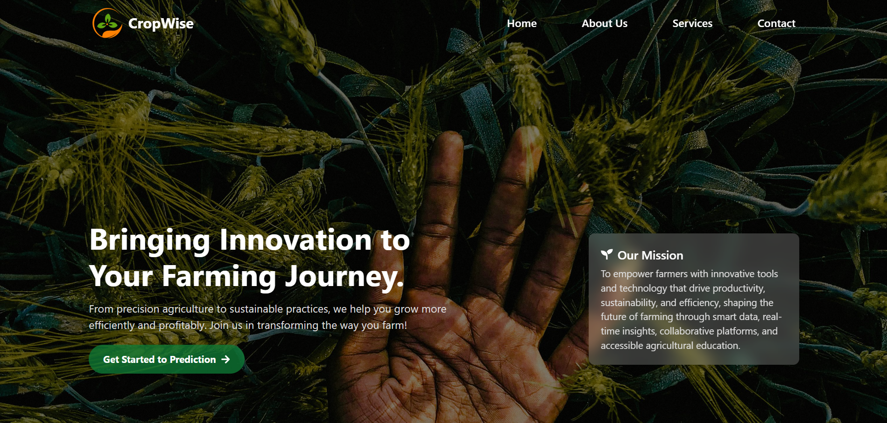
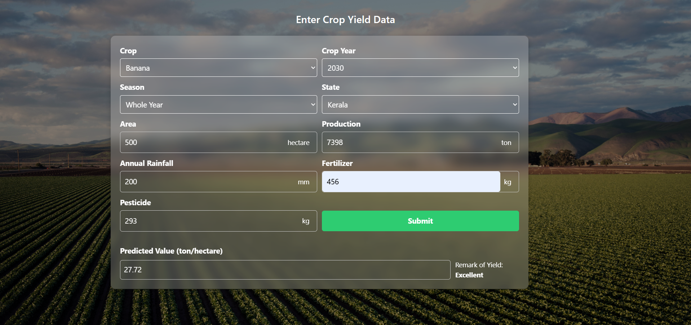

# CropWise – Smart Crop Yield Prediction Platform

CropWise is a modern web application that empowers farmers with AI-driven crop yield prediction, precision farming insights, and sustainable agriculture tools. Built with React, Vite, and Tailwind CSS, CropWise provides an intuitive interface for data-driven farming.

## Features

- **Home Page:** Engaging hero section, mission statement, and quick navigation.
- **Tabbed Info Section:** Learn about the platform's vision, mission, and team.
- **Services:** Overview of smart farming services (AI, analytics, irrigation, automation, etc.).
- **Crop Yield Prediction:** Enter crop, season, state, and environmental data to get AI-powered yield predictions.
- **Responsive Design:** Works seamlessly on desktop and mobile devices.
- **Modern UI:** Built with React, Tailwind CSS, and React Icons.
- **Data preprocessing and feature engineering**
- **Multiple ML algorithms** for regression and classification tasks
- **Model evaluation and performance metrics**
- **Interactive visualizations** for exploratory data analysis
- **Web-based interface** for user input and real-time predictions

## How It Works

1. **Data Collection:** Historical crop and environmental data are gathered from reliable sources.
2. **Preprocessing:** Data is cleaned, normalized, and relevant features are selected.
3. **Model Training:** Various ML algorithms are trained to find the best model for yield prediction.
4. **Evaluation:** Models are evaluated using metrics such as RMSE, MAE, and R² score.
5. **Prediction:** The best-performing model is used to predict crop yield based on user-provided inputs.

## Project Screenshots

